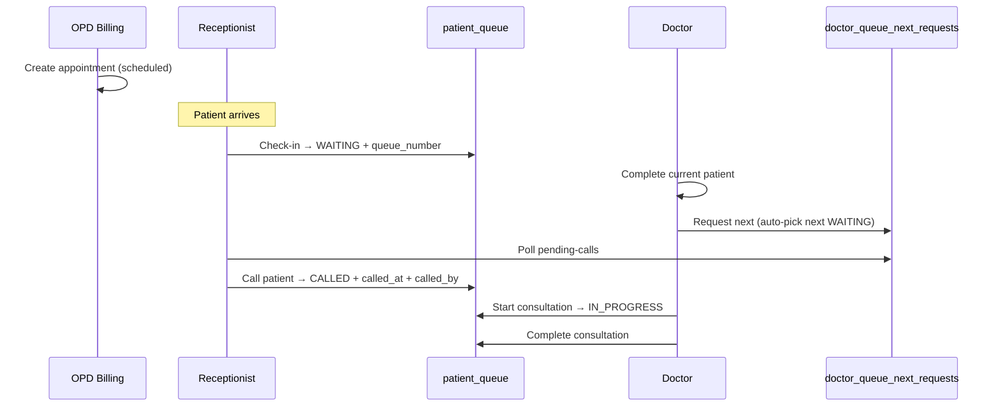

# Receptionist Module

Complete specification for the **Receptionist** module in SaffoCare HMS.

| Audience | Sections |
|----------|----------|
| Backend | [§4 Code structure](#4-code-structure), [§6 APIs](#6-apis), [§5 Database](#5-database) |
| Frontend | [§8 Screens](#8-frontend-screens), [§9 UI controls](#9-filters-search--pagination), [§3 Workflow](#3-end-to-end-workflow) |
| Product / QA | [§3 Workflow](#3-end-to-end-workflow), [§7 Build order](#7-build-order) |

**Related modules**

- [OPD Billing (backend)](../backend/roles/opd-billing.md) — register, pay, book appointments
- [Doctor (frontend)](../frontend/roles/doctor.md) — consultation, request next patient
- [API Reference](../frontend/API-REFERENCE.md)

---

## 1. Module overview

The **Receptionist** module manages the **live OPD waiting line** after OPD Billing has created an appointment. Reception does **not** register patients or collect payment.

| Module | Role (API) | Responsibility |
|--------|------------|----------------|
| OPD Billing | `opd_billing` | Register, pay, create `appointments` |
| **Receptionist** | `receptionist` | Check-in, queue board, answer doctor “next patient” calls |
| Doctor | `doctor` | Complete consultation, request next, start/complete |

### Design principles

1. **Appointment ≠ in queue** — booking (`scheduled`) is separate from arrival (`waiting` in `patient_queue`).
2. **Reception owns the waiting area** — check-in, token order, no-show, rejoin.
3. **Doctor owns timing** — reception does not know consult duration; doctor clicks **Next patient** when ready.
4. **Reception physically calls the patient** — after doctor’s signal; status `called` + `called_at` + `called_by`.
5. **Reception does not call next blindly** — no reception-only `call-next` without doctor request.
6. **No duplicate queue logic** — `receptionist_service.py` orchestrates; existing queue services do the work.
7. **No new tables** — reuse `patient_queue` and `doctor_queue_next_requests`.
8. **Duplicate check-in returns 409** — same appointment or same patient+doctor today.

---

## 2. Module boundaries

### Receptionist does

- Show today’s arrivals (scheduled, not checked in)
- Check-in patients → `patient_queue`
- View per-doctor queue boards
- Show pending doctor **“next patient”** requests (doctor signals timing)
- Call patient to doctor’s room
- Mark no-show / rejoin
- View queue history (past dates, reporting)

### Receptionist does not

- Register new patients (`POST /opd/patient/register`)
- Collect payment / generate bills
- Start or complete consultations (doctor only)
- Choose **when** doctor is ready (doctor clicks next)

### Depends on (other modules)

| Dependency | Why |
|------------|-----|
| `appointments` from OPD Billing | Check-in requires `appointment_id` |
| Doctor `POST /queue/request-next` | Creates pending call for reception |
| Doctor `PUT /queue/complete/{queue_id}` | Finishes current patient before next |

---

## 3. End-to-end workflow



### Status flow

**Appointments**

```
scheduled → waiting → in_progress → completed
              ↑           ↑              ↑
          check-in   call-patient   doctor complete
```

**patient_queue**

```
(none) → waiting → called → in_progress → completed
              ↑        ↑           ↑
          check-in  call-patient  doctor start

waiting / called → no_show → rejoin → waiting (new queue_number at end)
```

Statuses: `waiting`, `vitals_completed`, `called`, `in_progress`, `completed`, `no_show`, `cancelled`

### Step-by-step

| Step | Who | Action |
|------|-----|--------|
| 1 | OPD Billing | `POST /opd/appointments` → `scheduled` |
| 2 | Reception | Patient arrives → `POST /receptionist/check-in/{appointment_id}` |
| 3 | Reception | Monitor `GET /receptionist/doctor-queue/{doctor_id}` |
| 4 | Doctor | `PUT /queue/complete/{queue_id}` |
| 5 | Doctor | `POST /queue/request-next` (no `appointment_id` — auto next WAITING) |
| 6 | Reception | `GET /receptionist/pending-calls` → see doctor ready |
| 7 | Reception | `POST /receptionist/call-patient/{queue_id}` → patient to room |
| 8 | Doctor | `PUT /queue/start/{queue_id}` → `PUT /queue/complete/{queue_id}` |
| 9 | Repeat from step 5 | |

### Call patient vs start consultation

| Action | Who | Sets | Meaning |
|--------|-----|------|---------|
| **Call patient** | Reception | `called_at`, `called_by`, status `called` | Patient announced / sent to doctor's room |
| **Start consultation** | Doctor | `consultation_started_at`, status `in_progress` | Clinical encounter begins |
| **Complete** | Doctor | `consultation_completed_at`, status `completed` | Visit finished |

---

## 4. Code structure

### Files to create

```
HM-System/
├── Routers/
│   └── receptionist_router.py      # 9 HTTP endpoints (8 core + queue history)
├── Services/
│   └── receptionist_service.py   # Orchestration — no duplicated queue logic
└── Schemas/
    └── receptionist_schema.py    # Request/response models
```

Register router in `main.py`:

```python
from Routers.receptionist_router import router as receptionist_router
app.include_router(receptionist_router)
```

### Files to reuse (do not duplicate)

| Existing service | Functions to call |
|------------------|-------------------|
| `doctor_patient_queue_service.py` | `add_patient_to_queue_service`, `get_today_queue_service` |
| `doctor_queue_next_service.py` | `list_pending_next_requests_service`, call/fulfill request logic |
| `appointment_service.py` | Appointment queries (optional for arrivals) |

### `receptionist_service.py` function map

| Function | New logic? | Delegates to |
|----------|------------|--------------|
| `get_dashboard(db, doctor_id?)` | Yes | Counts on `PatientQueue`, `Appointment`, `DoctorQueueNextRequest` |
| `get_today_queue(...)` | Yes | All doctors today; filters, attention sort, pagination |
| `get_arrivals(db, doctor_id?, search?, page?, limit?)` | Yes | `appointments` + `patients`; search includes `appointment_uid` |
| `check_in_patient(db, appointment_id)` | No | `add_patient_to_queue_service` (409 on duplicate) |
| `get_doctor_queue(db, doctor_id, status?, search?, date?)` | Partial | Filtered `patient_queue` + attention sort |
| `get_pending_calls(db, doctor_id?)` | Partial | `list_pending_next_requests_service` |
| `call_patient(db, queue_id, handled_by)` | Yes | `fulfill_call_patient` → `called`, `called_at`, `called_by` |
| `mark_no_show(db, queue_id)` | Yes | Queue → `no_show`; cancel pending request |
| `rejoin_queue(db, queue_id)` | Yes | `no_show` → `waiting`; new token |
| `get_queue_history(db, filters, page, limit)` | Yes | Date-range `patient_queue`; search includes `appointment_uid` |
| `export_queue_history_csv(db, filters)` | Yes | Same filters → CSV |

### Example delegation (no copy-paste)

```python
# Services/receptionist_service.py

from Services.doctor_patient_queue_service import (
    add_patient_to_queue_service,
    get_today_queue_service,
)
from Services.doctor_queue_next_service import list_pending_next_requests_service


def check_in_patient(db, appointment_id: int):
    return add_patient_to_queue_service(db, appointment_id)


def get_doctor_queue(db, doctor_id: int):
    return get_today_queue_service(db, doctor_id)
```

### Router pattern (thin)

```python
# Routers/receptionist_router.py

router = APIRouter(prefix="/receptionist", tags=["Receptionist"])


@router.post("/check-in/{appointment_id}", status_code=201)
def check_in(appointment_id: int, db: Session = Depends(get_db), ...):
    queue = receptionist_service.check_in_patient(db, appointment_id)
    return {"success": True, "message": "Patient checked in", "queue": queue}
```

---

## 5. Database

### Tables used (no new tables)

| Table | Purpose |
|-------|---------|
| `appointments` | Bookings from OPD Billing |
| `patient_queue` | Live queue after check-in |
| `doctor_queue_next_requests` | Doctor “ready for next” signal |
| `patients` | Patient details (joins) |
| `users` | Doctor names (joins) |

### Schema changes required

**`patient_queue`**

| Column / enum | Action |
|---------------|--------|
| `called_at` | Done — `DateTime(timezone=True), nullable` |
| `called_by` | Done — FK → `users.id` (receptionist who called patient) |
| `appointment_uid` | Done — copied from appointment on check-in |
| `QueueStatus.called` | Done — value `"called"` (between waiting and in_progress) |
| `QueueStatus.no_show` | Done — value `"no_show"` |
| `token_number` | Keep (API may expose as `queue_number`) |
| `queue_entered_at` | Keep (API may expose as `checked_in_at`) |

**`doctor_queue_next_requests`**

| Column | Action |
|--------|--------|
| `queue_id` | **Recommended** — FK → `patient_queue.id` |
| Table migration | **Add** Alembic migration if missing |

### `doctor_queue_next_requests` (existing)

| Field | Description |
|-------|-------------|
| `doctor_id` | Which doctor is ready |
| `appointment_id` | Next patient’s appointment |
| `patient_id` | Next patient |
| `status` | `pending` \| `fulfilled` \| `cancelled` |
| `request_date` | Today (IST) |
| `requested_at` | When doctor clicked next |
| `handled_at` / `handled_by` | When reception called patient |

**Rule:** One pending request per doctor per day; new request cancels previous pending.

---

## 6. APIs

**Base path:** `/receptionist`  
**Auth:** `Authorization: Bearer <token>`

### Summary

| # | Method | Path | Permission |
|---|--------|------|------------|
| 1 | GET | `/receptionist/dashboard` | `opd:view` |
| 2 | GET | `/receptionist/today-queue` | `opd:view` |
| 3 | GET | `/receptionist/arrivals` | `appointments:view` |
| 4 | POST | `/receptionist/check-in/{appointment_id}` | `appointments:update` |
| 5 | GET | `/receptionist/doctor-queue/{doctor_id}` | `opd:view` |
| 6 | GET | `/receptionist/pending-calls` | `opd:view` |
| 7 | POST | `/receptionist/call-patient/{queue_id}` | `appointments:update` |
| 8 | PATCH | `/receptionist/queue/{queue_id}/no-show` | `appointments:update` |
| 9 | PATCH | `/receptionist/queue/{queue_id}/rejoin` | `appointments:update` |
| 10 | GET | `/receptionist/queue-history` | `opd:view` |
| 11 | GET | `/receptionist/queue-history/export` | `opd:view` |

### Paginated list response shape (standard)

Use for **arrivals** and **queue-history**:

```json
{
  "success": true,
  "total": 45,
  "page": 1,
  "limit": 20,
  "data": []
}
```

Field name `data` or endpoint-specific (`arrivals`, `history`) — pick one in `receptionist_schema.py` and use consistently.

### 1. Dashboard

**`GET /receptionist/dashboard`**

Receptionist home screen — aggregate counts for today (IST). Optional `?doctor_id=5` for one doctor.

**Response**

```json
{
  "success": true,
  "data": {
    "total_patients": 45,
    "waiting": 10,
    "called": 2,
    "in_progress": 3,
    "completed": 30,
    "no_show": 2,
    "pending_doctor_requests": 2,
    "todays_arrivals": 52,
    "todays_checked_in": 45,
    "todays_cancelled": 3,
    "average_waiting_time_minutes": 18.5
  }
}
```

| Field | Source |
|-------|--------|
| `waiting` / `called` / `in_progress` / `completed` / `no_show` | `patient_queue` where `queue_date = today` (IST) |
| `pending_doctor_requests` | `doctor_queue_next_requests` where `status = pending` and `request_date = today` |
| `total_patients` / `todays_checked_in` | All `patient_queue` rows today |
| `todays_arrivals` | `appointments` scheduled today |
| `todays_cancelled` | Today's appointments with `status = cancelled` |
| `average_waiting_time_minutes` | Avg minutes from `queue_entered_at` to `consultation_started_at` (today; `null` if none) |

---

### 2. Arrivals

**`GET /receptionist/arrivals`**

Today’s appointments **not yet checked in**.

**Query params**

| Param | Type | Default | Description |
|-------|------|---------|-------------|
| `doctor_id` | int | — | Filter by doctor |
| `search` | string | — | Patient name, UHID, phone, or **appointment_uid** (ILIKE) |
| `page` | int | 1 | Page number |
| `limit` | int | 20 | Page size (max 100) |

**Examples**

```
GET /receptionist/arrivals
GET /receptionist/arrivals?doctor_id=5
GET /receptionist/arrivals?search=nilesh
GET /receptionist/arrivals?doctor_id=5&search=nilesh&page=1&limit=20
```

**Frontend:** Debounce search **400ms** before API call.

**Logic**

- `appointments.scheduled_at` is today (IST)
- `appointments.status = scheduled`
- No row in `patient_queue` for this `appointment_id`

**Response**

```json
{
  "success": true,
  "total": 45,
  "page": 1,
  "limit": 20,
  "arrivals": [
    {
      "appointment_id": 42,
      "appointment_uid": "AP-0042",
      "patient_id": 10,
      "patient_name": "Nilesh Patil",
      "patient_uid": "P-1001",
      "doctor_id": 5,
      "doctor_name": "Dr. Sharma",
      "scheduled_at": "2026-06-23T10:30:00+05:30"
    }
  ]
}
```

> Do **not** use `GET /opd/visits/today` or `GET /opd/queue/today` for arrivals — they return `opd_visits` (billing), not `appointments`. See [Queue endpoints guide](../flows/queue-endpoints-guide.md).

---

### 3. Check-in

**`POST /receptionist/check-in/{appointment_id}`**

Patient arrived → create `patient_queue` entry.

**Reuses:** `add_patient_to_queue_service()`

**Updates**

- `patient_queue` created — `status = waiting`, `token_number` assigned
- `appointments.status = waiting`

**Response 201**

```json
{
  "success": true,
  "message": "Patient checked in successfully",
  "queue": {
    "id": 16,
    "appointment_id": 42,
    "queue_number": 7,
    "patient_name": "Nilesh Patil",
    "status": "waiting",
    "checked_in_at": "2026-06-23T10:05:00+05:30"
  }
}
```

**Errors**

| Status | When |
|--------|------|
| 404 | Appointment not found |
| 409 | Already checked in (same appointment or same patient+doctor today) |

---

### 3b. Today's queue (all doctors)

**`GET /receptionist/today-queue`**

All patients checked in today across all doctors. Sorted: **priority DESC** → **called/waiting first** → **token ASC**.

**Query params:** `doctor_id`, `doctor_name`, `patient_id`, `status`, `search`, `page`, `limit`

**Search matches:** patient name, UHID, phone, patient id, token, appointment UID, doctor name.

---

### 4. Doctor queue

**`GET /receptionist/doctor-queue/{doctor_id}`**

One doctor’s full queue for today.

**Reuses:** `get_today_queue_service(db, doctor_id)` with optional server-side filters.

**Query params**

| Param | Type | Default | Description |
|-------|------|---------|-------------|
| `status` | string | — | `waiting`, `called`, `in_progress`, `completed`, `no_show` |
| `search` | string | — | Patient name, UHID, queue number, patient id, appointment UID |
| `date` | date | today | Queue date (IST) |
| `page` | int | — | Optional if lists are large |
| `limit` | int | — | Optional |

**Examples**

```
GET /receptionist/doctor-queue/5
GET /receptionist/doctor-queue/5?status=waiting
GET /receptionist/doctor-queue/5?search=rahul
```

**Response**

```json
{
  "success": true,
  "doctor_id": 5,
  "total": 3,
  "queue": [
    {
      "queue_id": 14,
      "queue_number": 5,
      "patient_name": "Rahul",
      "patient_uid": "P-1002",
      "status": "in_progress",
      "checked_in_at": "2026-06-23T09:15:00+05:30",
      "called_at": "2026-06-23T09:20:00+05:30"
    },
    {
      "queue_id": 16,
      "queue_number": 7,
      "patient_name": "Nilesh Patil",
      "patient_uid": "P-1001",
      "status": "waiting",
      "checked_in_at": "2026-06-23T10:05:00+05:30",
      "called_at": null
    }
  ]
}
```

Statuses are lowercase strings matching the DB enum: `waiting`, `called`, `vitals_completed`, `in_progress`, `completed`, `no_show`, `cancelled`.

---

### 5. Pending calls

**`GET /receptionist/pending-calls`**

Doctors who clicked **Next patient** — reception must call these patients.

**Reuses:** `list_pending_next_requests_service()`  
**Enrich with:** `queue_id`, `queue_number` from `patient_queue`

**Response**

```json
{
  "success": true,
  "total": 1,
  "pending_calls": [
    {
      "request_id": 3,
      "doctor_id": 5,
      "doctor_name": "Dr. Sharma",
      "queue_id": 16,
      "queue_number": 7,
      "patient_name": "Nilesh Patil",
      "patient_uid": "P-1001",
      "appointment_id": 42,
      "requested_at": "2026-06-23T10:30:00+05:30"
    }
  ]
}
```

**Query params**

| Param | Type | Description |
|-------|------|-------------|
| `doctor_id` | int | Optional — filter by doctor |

**UI:** Poll every **5–10 seconds** while screen is open; sidebar badge when `total > 0`; sound on new `request_id`.

**Legacy equivalent:** `GET /opd/queue/next-requests` (deprecate after migration).

---

### 6. Call patient

**`POST /receptionist/call-patient/{queue_id}`**

Reception sends patient to doctor’s room.

**Updates**

- `patient_queue.status` → `called`
- `patient_queue.called_at` → now
- `patient_queue.called_by` → receptionist user id; API returns `called_by` (id) and `called_by_name`
- `appointments.status` stays `waiting` until doctor starts
- Matching `doctor_queue_next_requests` → `fulfilled`, `handled_by`, `handled_at`

**Response 200**

```json
{
  "success": true,
  "message": "Patient called to doctor room",
  "queue": {
    "queue_id": 16,
    "queue_number": 7,
    "status": "called",
    "called_at": "2026-06-23T10:32:00+05:30",
    "called_by": 12,
    "called_by_name": "Priya Reception"
  }
}
```

**Business rules**

- Queue row must be `waiting` or `vitals_completed`.
- Doctor `PUT /queue/start` moves `called` → `in_progress`.
- Only one `in_progress` patient per doctor at a time.

**Legacy equivalent:** `POST /opd/queue/send-in` (uses `appointment_id` — deprecate).

---

### 7. No-show

**`PATCH /receptionist/queue/{queue_id}/no-show`**

Patient absent when doctor requested next.

**Updates**

- `patient_queue.status` → `no_show`
- Cancel or fulfill related pending `doctor_queue_next_requests` as per policy

**Typical flow**

1. Doctor requests next → pending call for token #7  
2. Reception cannot find patient → no-show  
3. Doctor requests next again → system picks next `waiting` patient  

---

### 8. Rejoin

**`PATCH /receptionist/queue/{queue_id}/rejoin`**

Patient returned after no-show.

**Updates**

- `status` → `waiting`
- `queue_number` → `last_token + 1` (back of line)
- Clear `called_at` and `called_by` if set

---

### 9. Queue history

**`GET /receptionist/queue-history`**

Read-only report from existing `patient_queue` rows. **No new table.**

**When to use**

- Past dates, end-of-day reports, disputes
- For **today's live board**, use `GET /receptionist/today-queue`

**Query params**

| Param | Type | Default | Description |
|-------|------|---------|-------------|
| `date` | date | — | Single day (alternative to range) |
| `date_from` | date | — | Range start |
| `date_to` | date | — | Range end |
| `doctor_id` | int | — | Filter by doctor |
| `status` | string | — | `completed`, `no_show`, `called`, etc. |
| `search` | string | — | Name, UHID, phone, patient id, token, **appointment_uid**, doctor name |
| `page` | int | 1 | Required for large datasets |
| `limit` | int | 20 | Max 100 |

**Example**

```
GET /receptionist/queue-history?date_from=2026-06-01&date_to=2026-06-23&doctor_id=5&status=completed&search=APT-0042&page=1&limit=20
```

**Response**

```json
{
  "success": true,
  "date_from": "2026-06-01",
  "date_to": "2026-06-23",
  "total": 120,
  "page": 1,
  "limit": 20,
  "history": [
    {
      "queue_id": 14,
      "appointment_uid": "APT-0014",
      "queue_date": "2026-06-22",
      "queue_number": 5,
      "patient_name": "Rahul",
      "patient_uid": "P-1002",
      "doctor_name": "Dr. Sharma",
      "status": "completed",
      "checked_in_at": "2026-06-22T09:15:00+05:30",
      "called_at": "2026-06-22T09:20:00+05:30",
      "called_by": 12,
    "called_by_name": "Priya Reception",
      "consultation_completed_at": "2026-06-22T09:40:00+05:30"
    }
  ]
}
```

---

### 10. Queue history export

**`GET /receptionist/queue-history/export`**

Same filters as queue history. Returns **CSV** file download (`format=csv`; opens in Excel).

```
GET /receptionist/queue-history/export?date_from=2026-06-01&date_to=2026-06-23&format=csv
```

Columns include: queue date, token, appointment UID, patient, doctor, status, checked in, called at, called by user id, consultation times.

---

## 7. Build order

| Step | API | Notes |
|------|-----|-------|
| 1 | `GET /receptionist/arrivals` | Defines who can check in |
| 2 | `POST /receptionist/check-in/{appointment_id}` | Wrap `add_patient_to_queue_service` |
| 3 | `GET /receptionist/doctor-queue/{doctor_id}` | Wrap `get_today_queue_service` |
| 4 | `GET /receptionist/pending-calls` | Wrap + enrich pending requests |
| 5 | `POST /receptionist/call-patient/{queue_id}` | Core handoff; refactor from `send-in` |
| 6 | `PATCH /receptionist/queue/{queue_id}/no-show` | New logic in `receptionist_service` |
| 7 | `PATCH /receptionist/queue/{queue_id}/rejoin` | New logic in `receptionist_service` |
| 8 | `GET /receptionist/dashboard` | Manager metrics + optional `doctor_id` |
| 9 | `GET /receptionist/today-queue` | All doctors; filters + attention sort |
| 10 | `GET /receptionist/queue-history` | Reporting; paginated date-range query |
| 11 | `GET /receptionist/queue-history/export` | CSV export |

**Parallel:** Refactor doctor `POST /queue/request-next` (Step 4–5 dependency) — remove required `appointment_id`; auto-pick lowest `waiting` `token_number` for logged-in doctor.

**Infrastructure before Step 1**

1. Alembic migration — `called_at`, `no_show`, `doctor_queue_next_requests` table  
2. `receptionist` role in `seed.py`  
3. `receptionist_router.py`, `receptionist_service.py`, `receptionist_schema.py`  
4. Register router in `main.py`

---

## 8. Frontend screens

**Detailed UI spec (filters, search, pagination, empty states):** [frontend/roles/receptionist.md](../frontend/roles/receptionist.md)

**Role from API:** `receptionist`  
**Folder:** `src/pages/receptionist/`  
**URL prefix:** `/receptionist/`

### Routes (summary)

| Route | Screen |
|-------|--------|
| `/receptionist/dashboard` | Stats + quick links |
| `/receptionist/arrivals` | Check-in list (search, pagination) |
| `/receptionist/today` | All doctors checked-in today |
| `/receptionist/queues` | Doctor queue board (status tabs) |
| `/receptionist/pending-calls` | Doctor next requests (poll) |
| `/receptionist/history` | Queue history report |

---

## 9. Filters, search & pagination

Per-screen matrix for backend query params and frontend controls.

| Screen | Search | Filters | Pagination | Polling |
|--------|--------|---------|------------|---------|
| Dashboard | — | — | — | Optional 30–60s refresh |
| **Arrivals** | `search` (400ms debounce) | `doctor_id`, dept (UI) | `page`, `limit` | — |
| **Doctor queue** | `search` (optional) | `doctor_id` (path), `status`, `date` | Optional | Manual refresh |
| **Pending calls** | — | `doctor_id` (optional) | — | **5–10s poll** |
| **Queue history** | `search` | `date` / `date_from`–`date_to`, `doctor_id`, `status` | `page`, `limit` | — |

### Shared helper APIs (frontend only)

| API | Used for |
|-----|----------|
| `GET /opd/departments` | Department → doctor dropdown |
| `GET /opd/doctors/department/{department_id}` | Doctor select on Arrivals / Queues |

### UX standards (match nurse module)

| Pattern | Rule |
|---------|------|
| Search debounce | 400ms |
| Default page size | 20 (max 100) |
| Empty states | One line + refresh or clear filters |
| Loading | Skeleton rows / cards |
| Errors | Toast with API `detail` + Retry |

---

## 10. Doctor module (related, not Receptionist)

These exist under `/queue` today:

| Method | Path | Status |
|--------|------|--------|
| GET | `/queue/today` | Built |
| GET | `/queue/current` | Built |
| PUT | `/queue/start/{queue_id}` | Built |
| PUT | `/queue/complete/{queue_id}` | Built |
| POST | `/queue/request-next` | **Refactor** — auto-pick next `waiting`; no `appointment_id` in body |

---

## 11. Permissions & role

### Target role: `receptionist`

Add to `seed.py`:

```python
"receptionist": {
    "description": "Reception / front desk queue management",
    "permissions": [
        "patients:view",
        "opd:view",
        "appointments:view",
        "appointments:update",
    ],
},
```

`Constants/constants.py` already defines `Role.RECEPTIONIST = "receptionist"`.

### Register receptionist user

**`POST /auth/register`**

| Field | Value |
|-------|-------|
| `role_id` | ID of `receptionist` from `GET /roles/` |

---

## 12. Implementation status

| Item | Status |
|------|--------|
| `Routers/receptionist_router.py` | Done — 11 endpoints |
| `Services/receptionist_service.py` | Done |
| `Schemas/receptionist_schema.py` | Done |
| `receptionist` role in seed | Done |
| `patient_queue.called_at` | Done — migration `7954ceb7aea4` |
| `QueueStatus.no_show` | Done |
| `QueueStatus.called` + `called_by` | Done — migration `f7a8b9c0d1e2` |
| `doctor_queue_next_requests` migration | Done |
| `POST /queue/request-next` auto-pick | Done |
| Legacy endpoints deprecated | Done |
| `appointments.status` PostgreSQL enum | Done — migration `e1f2a3b4c5d6` |
| `doctor_queue_next_requests.queue_id` FK | Done |
| `GET /receptionist/today-queue` + filters | Done |
| Dashboard manager metrics + `doctor_id` | Done |
| Arrivals / history `appointment_uid` search | Done |
| Queue history CSV export | Done |
| Duplicate check-in 409 | Done |
| OPD register / visit → auto appointment | Done |
| Frontend filters & poll hooks | To build — see frontend receptionist.md |

---

## 13. Golden rules

1. Receptionist module is **queue only** — not billing.  
2. Check-in requires an **appointment** from OPD Billing.  
3. Doctor clicks **next** when ready — reception does not guess timing.  
4. Reception **calls patient** after doctor’s signal.  
5. FIFO by `queue_number` when doctor requests next.  
6. One `in_progress` patient per doctor at a time; `called` means patient heading to room.
7. `receptionist_service.py` **reuses** queue services — no duplicated logic.
8. Status values in API responses use DB lowercase enums (`waiting`, `called`, `in_progress`, …).
9. List endpoints that can grow use **server-side pagination** (`page`, `limit`).
10. **Pending calls** uses **polling**, not WebSocket, for v1.
11. Queue history supports **CSV export** via `/queue-history/export`.

---

## 14. One-page cheat sheet

```
OPD Billing     →  appointment (scheduled)
Reception       →  check-in (waiting in patient_queue)
Doctor          →  complete → request-next
Reception       →  pending-calls → call-patient (called + called_by)
Doctor          →  start (in_progress) → complete
```

**11 Receptionist APIs · 0 new tables · router + service + schema**

---

*Last updated: June 2026 — SaffoCare HMS Receptionist Module*
